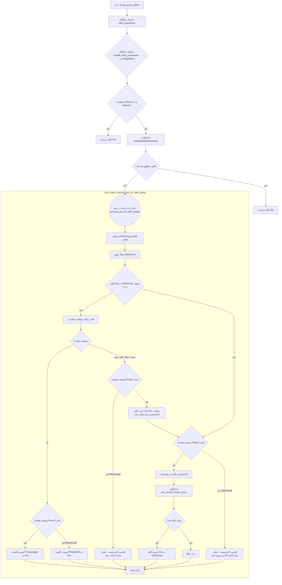

# jira integration workflow

```mermaid
graph TD
    A[پردازش هشدار - اپ alerts] --> B[ارسال سیگنال: alert_processed];
    B --> C{دریافت سیگنال: handle_alert_processed - اپ integrations};

    C --> D{وضعیت: Firing و عدم Silence؟};
    D -- خیر --> EndCheck1[پایان بررسی Jira];

    D -- بلی --> E[فراخوانی JiraRuleMatcherService];
    E --> F{قانون مطابق پیدا شد؟};
    F -- خیر --> EndCheck2[پایان بررسی Jira];

    F -- بلی --> G((قرار دادن تسک در صف: process_jira_for_alert_group));

    subgraph "تسک Celery: process_jira_for_alert_group"
        direction LR
        G --> T1[دریافت AlertGroup و Rule از DB];
        T1 --> T2[ایجاد نمونه JiraService];
        T2 --> T3{کلید Jira در AlertGroup وجود دارد؟};

        %% --- مسیر بلی: تیکت Jira وجود دارد ---
        T3 -- بلی --> T4[دریافت وضعیت تیکت از Jira];
        T4 --> T5{وضعیت تیکت؟};

        T5 -- "باز" --> T6{وضعیت هشدار Firing است؟};
        T6 -- بلی --> T7[افزودن کامنت 'Firing Again' به Jira];
        T6 -- خیر (Resolved) --> T8[افزودن کامنت 'Resolved' به Jira];
        T7 --> T_End[پایان تسک];
        T8 --> T_End;

        T5 -- "بسته / خطا / یافت نشد" --> T9{وضعیت هشدار Firing است؟};
        T9 -- بلی --> T10[پاک کردن کلید Jira محلی / آماده‌سازی برای تیکت جدید];
        T10 --> T11;

        T9 -- خیر (Resolved) --> T12[اقدامی لازم نیست - تیکت بسته یا یافت نشد];
        T12 --> T_End;

        %% --- مسیر خیر: تیکت Jira وجود ندارد (یا باید جدید ایجاد شود) ---
        T3 -- خیر --> T11{وضعیت هشدار Firing است؟};
        T11 -- بلی --> T13[آماده‌سازی خلاصه و توضیحات];
        T13 --> T14[فراخوانی jira_service.create_issue];
        T14 --> T15{تیکت ایجاد شد؟};
        T15 -- بلی --> T16[ذخیره کلید Jira در AlertGroup];
        T15 -- خیر --> T17[ثبت خطا];
        T16 --> T_End;
        T17 --> T_End;

        T11 -- خیر (Resolved) --> T18[اقدامی لازم نیست - تیکتی برای کامنت‌گذاری وجود ندارد];
        T18 --> T_End;
    end
```