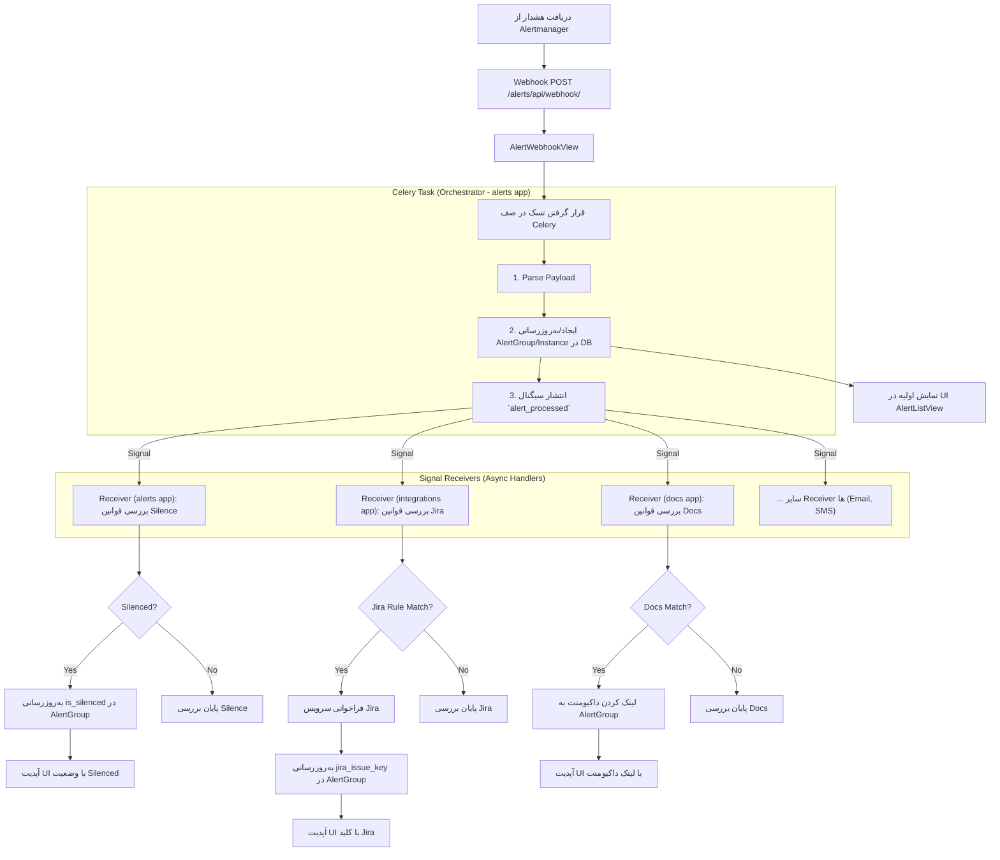

# جریان کاری پردازش هشدارها

```mermaid
graph TD
    A["دریافت هشدار از Alertmanager"] --> B["Webhook POST /alerts/api/webhook/"]
    B --> C["AlertWebhookView"]
    C --> D["قرار گرفتن تسک در صف Celery"]

    subgraph "Celery Task (Orchestrator - alerts app)"
        D --> D1["1. Parse Payload"]
        D1 --> D2["2. ایجاد/به‌روزرسانی AlertGroup/Instance در DB"]
        D2 --> D3["3. انتشار سیگنال `alert_processed`"]
    end

    subgraph "Signal Receivers (Async Handlers)"
        D3 -- Signal --> E["Receiver (alerts app): بررسی قوانین Silence"]
        D3 -- Signal --> F["Receiver (integrations app): بررسی قوانین Jira"]
        D3 -- Signal --> G["Receiver (docs app): بررسی قوانین Docs"]
        D3 -- Signal --> H["... سایر Receiver ها (Email, SMS)"]
    end

    E --> E1{"Silenced?"}
    E1 -- Yes --> E2["به‌روزرسانی is_silenced در AlertGroup"]
    E1 -- No --> E3["پایان بررسی Silence"]

    F --> F1{"Jira Rule Match?"}
    F1 -- Yes --> F2["فراخوانی سرویس Jira"]
    F1 -- No --> F3["پایان بررسی Jira"]
    F2 --> F4["به‌روزرسانی jira_issue_key در AlertGroup"]


    G --> G1{"Docs Match?"}
    G1 -- Yes --> G2["لینک کردن داکیومنت به AlertGroup"]
    G1 -- No --> G3["پایان بررسی Docs"]

    %% Connections to UI (Conceptual)
    D2 --> L["نمایش اولیه در UI AlertListView"]
    E2 --> L2["آپدیت UI با وضعیت Silenced"]
    F4 --> L3["آپدیت UI با کلید Jira"]
    G2 --> L4["آپدیت UI با لینک داکیومنت"]
```